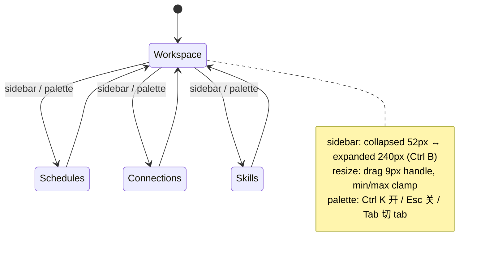

# 03 · Interaction State Map

## 状态机

## Tier A（必须真实可用，全部实测）

| 交互 | 触发 | 反馈 |
| --- | --- | --- |
| 切屏 | sidebar 四项 / palette Go To | 主区换屏，active 项 `bg-surface-secondary` |
| 折叠侧栏 | Ctrl B / 顶部按钮 | width 200ms 过渡，仅剩图标 + tooltip |
| 拖拽调宽 | 9px handle (col-resize) | 实时跟手，clamp 到 min/max |
| Command palette | Ctrl K / Search 按钮 | 居中 modal（桌面）/ bottom sheet（移动），Esc 关闭 |
| palette tabs | 点击 / Tab 键 | All / Tasks / Topics 过滤 |
| Projects / Resources | 点击 | aria-expanded 折叠树 |
| 移动端看板切换 | kanban 图标 | chat ↔ board |
| tooltip | hover 图标 | 400ms 延迟浮现（`group-hover:delay-[400ms]`） |

## Tier B（视觉装饰，pointer-events: none）

主区内容（聊天气泡、任务卡、连接卡、行内图标按钮）——可看不可点，避免"死按钮"感。

## Tier C（mock 结果）

palette 输入过滤、tab 分类过滤、（我们的 V2）任务状态流转——全部在本地 mock store 完成。

## 自动行为（实测）

demo 有 **idle 自动重播**：用户无操作一段时间后，workspace 叙事重置从头自动播放（气泡逐条出现、看板计数随之变化）；任何用户操作打断。这是"会呼吸的 demo"的关键。
